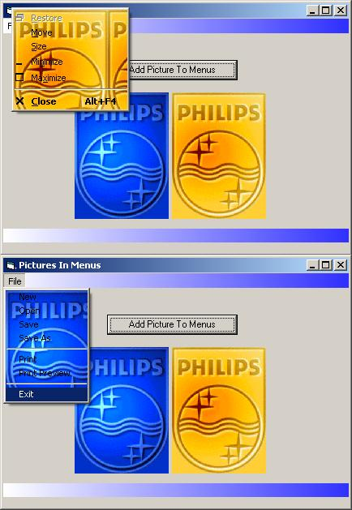



## Add Picture To Menu

### Description

Adds A Background Picture To Menus And MenuBar By Using MENUINFO To Set The Menu Background Brush To A Picture. ONLY TESTED ON WINDOWS/XP! Might work on other operationg system.
 
### More Info
 
Puts A Picture In A Menus Background

             |
---                |---
**Submitted On**   |2006-03-05 18:41:16
**By**             |[Show](https://github.com/Planet-Source-Code/PSCIndex/blob/master/ByAuthor/show.md)
**Level**          |Intermediate
**User Rating**    |4.5 (27 globes from 6 users)
**Compatibility**  |VB 5\.0, VB 6\.0
**Category**       |[Graphics](https://github.com/Planet-Source-Code/PSCIndex/blob/master/ByCategory/graphics__1-46.md)
**World**          |[Visual Basic](https://github.com/Planet-Source-Code/PSCIndex/blob/master/ByWorld/visual-basic.md)
**Archive File**   |[Add\_Pictur197814352006\.zip](https://github.com/Planet-Source-Code/show-add-picture-to-menu__1-64541/archive/master.zip)

